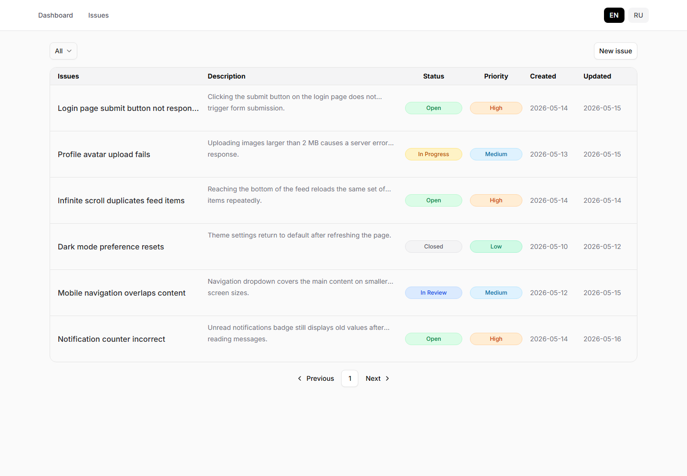
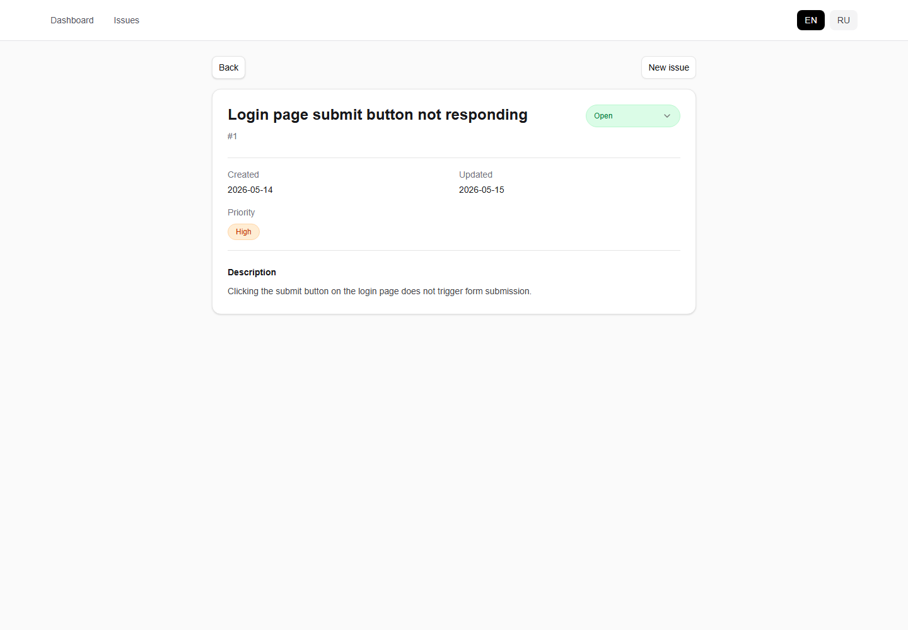
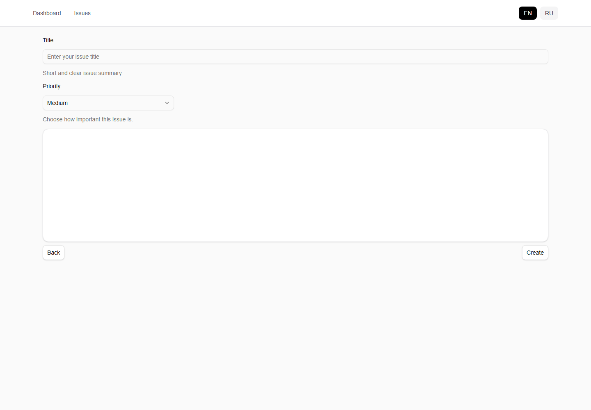

# Issue Desk

Issue Desk is a React application for managing issues: viewing a task list, filtering by status, creating new issues, opening issue details, and updating task status.

## Tech Stack

- React 19
- Vite
- React Router
- Tailwind CSS
- Radix UI / shadcn-style components
- TipTap editor
- i18next / react-i18next
- Sonner for toast notifications

## Features

- Issue list with pagination.
- Status filtering.
- Colored status and priority badges.
- New issue creation.
- Priority selection during issue creation.
- Issue details page.
- Status updates from the details page.
- Automatic `updatedAt` update when status changes.
- EN / RU language switcher.
- Empty state for filtered lists without matching issues.

## Screenshots

### Issues List



### Issue Details



### Create Issue



## Getting Started

Install dependencies:

```bash
npm install
```

Start the development server:

```bash
npm run dev
```

Run lint checks:

```bash
npm run lint
```

Build the project:

```bash
npm run build
```

## State Flow

The main issue list is stored in `App.jsx`:

```txt
App
  issues
  onCreateIssue
  onUpdateIssueStatus
```

Issue creation:

```txt
IssueEditor
  -> onCreateIssue(data)
  -> App updates issues
  -> IssuesPage receives the updated list
```

Status update:

```txt
IssueDetailsPage
  -> onUpdateIssueStatus(id, nextStatus)
  -> App updates issue.status and updatedAt
  -> IssuesList and IssueDetailsPage re-render
```

Filtering and pagination live inside `IssuesPage`, because they are UI state for the list page.

## Project Structure

```txt
src/
  App.jsx
  main.jsx
  i18next.js
  components/
    Header.jsx
    mocks/
      issues.js
    page/
      DashBoard/
      Issues/
        constants.js
        CreateIssuePage.jsx
        IssuesCreateTipTap.jsx
        components/
          IssuesPage.jsx
          IssuesList.jsx
          IssueDetailsPage.jsx
          StateFilter.jsx
          PaginationIssuesList.jsx
    ui/
```

## Current State

The project currently uses mock data from `src/components/mocks/issues.js`. Data is stored only in React state, so created issues and status changes reset after a page refresh.

## Possible Improvements

- Build out the dashboard page.
- Add search by title and description.
- Add sorting by date, status, and priority.
- Improve the mobile layout for the issues table.
- Move issue-related state logic into a custom hook, such as `useIssues`.
- Add lazy loading for pages to reduce the main bundle size.
